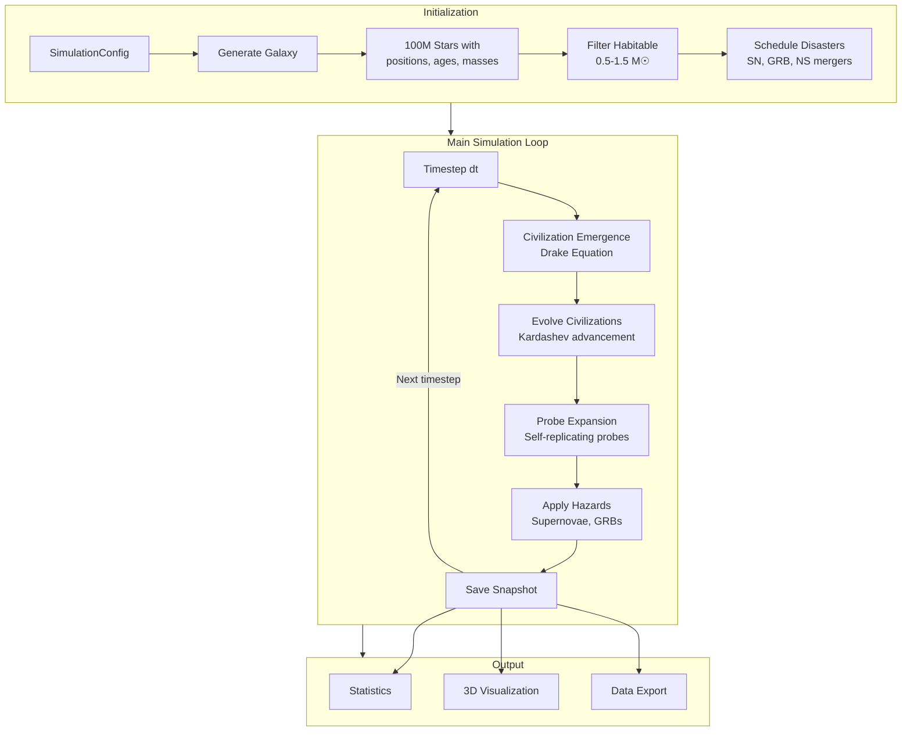
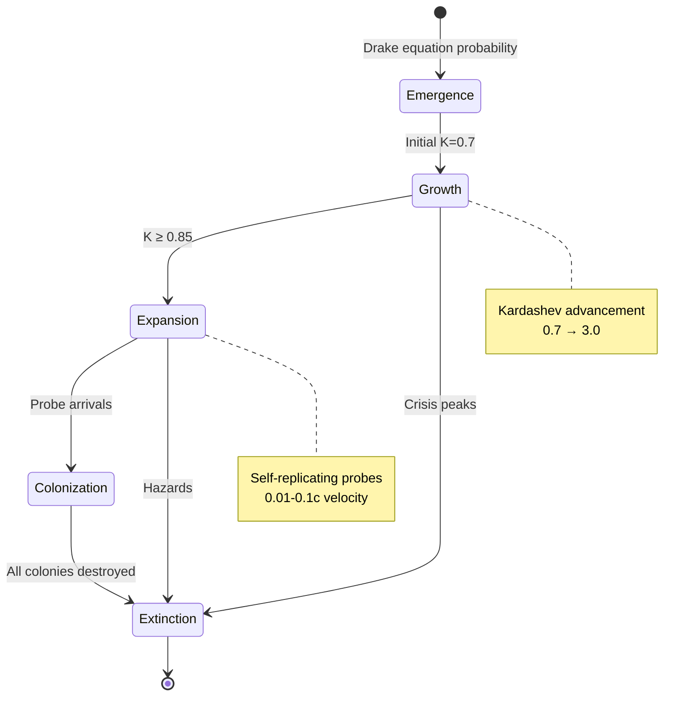

<p align="center">
  
</p>

<h1 align="center">Great Silence</h1>

<p align="center">
  <strong>Monte Carlo Simulation of Galactic Civilizations</strong>
</p>

<p align="center">
  <a href="https://www.python.org/downloads/"></a>
  <a href="https://github.com/psf/black"></a>
  <a href="https://github.com/astral-sh/ruff"></a>
  <a href="#license"></a>
</p>

<p align="center">
  Explore the <strong>Fermi Paradox</strong> through Monte Carlo simulation of galactic civilizations,<br/>
  astrophysical hazards, and the <strong>Great Filter</strong>.
</p>

---

```
       ╔═══════════════════════════════════════════════════════════════╗
       ║   ✦  .  ˚  Where is everybody?  ˚  .  ✦                       ║
       ║      ·  ✧  ·                                                  ║
       ║   The Milky Way contains 100-400 billion stars.               ║
       ║   If even a tiny fraction develop intelligent life,           ║
       ║   the galaxy should be teeming with civilizations.            ║
       ║      ✧  ·  ✦                                                  ║
       ║   Yet we see... nothing. Only silence.                        ║
       ╚═══════════════════════════════════════════════════════════════╝
```

## Overview

**Great Silence** is a physics-based simulation framework for exploring solutions to the Fermi Paradox. It models:

- **🌟 Realistic Galaxy Structure** — Hernquist bulge, exponential disk, spiral arms, stellar motion
- **🧬 Civilization Emergence** — Drake equation with configurable parameters
- **🚀 Interstellar Expansion** — Self-replicating probes with relativistic travel times
- **💥 Astrophysical Hazards** — Supernovae, gamma-ray bursts, neutron star mergers
- **⚠️ Great Filter Scenarios** — Crisis peaks at technological transition points
- **📊 Monte Carlo Analysis** — Statistical ensembles across parameter space

### Scientific Foundations

| Concept | Description |
|---------|-------------|
| **Drake Equation** | Estimates the number of civilizations: N = R★ × fp × ne × fl × fi × fc × L |
| **Kardashev Scale** | Civilization energy usage: Type I (planet), Type II (star), Type III (galaxy) |
| **Great Filter** | Hypothetical barrier preventing civilizations from becoming spacefaring |
| **Fermi Paradox** | The contradiction between lack of evidence and high probability estimates |

---

## ✨ Interactive Visualization

Great Silence includes a stunning **Three.js WebGL visualization** that renders:

- 🌌 **Star particle systems** with GPU-accelerated shaders
- 🏛️ **Civilization sprites** colored by Kardashev scale
- 🛸 **Probe trajectories** showing expansion wavefronts
- 💥 **Disaster markers** for supernovae, GRBs, and kilonova events
- 🎬 **Timeline animation** with playback controls and scrubbing
- 📸 **Camera presets** (top-down, edge-on, angled views)

**[🚀 Try the Live Demo](https://grburgess.github.io/great_silence/demo/)** *(GitHub Pages)*

### Generate Your Own Visualization

```python
from great_silence import GalaxySimulation, SimulationConfig
from great_silence.visualization.threejs import export_html

config = SimulationConfig.with_preset("optimistic")
config.simulation.save_snapshots = True

sim = GalaxySimulation(config)
sim.run()

export_html(sim, "galaxy_visualization.html", animated=True)
```

Then open `galaxy_visualization.html` in your browser!

---

## 🚀 Quick Start

```bash
# Install
pip install great-silence

# Run a quick simulation with visualization
great-silence --quick --visualize
```

---

## 📦 Installation

### Basic Installation

```bash
pip install great-silence
```

### Development Installation

```bash
# Clone the repository
git clone https://github.com/grburgess/great_silence.git
cd great_silence

# Install in development mode with all dependencies
pip install -e ".[dev,viz,webapp,notebook]"
```

### Optional Dependencies

| Extra | Description | Command |
|-------|-------------|---------|
| `webapp` | NiceGUI web interface | `pip install -e ".[webapp]"` |
| `viz` | Advanced 3D visualization (Plotly, PyVista) | `pip install -e ".[viz]"` |
| `notebook` | Jupyter notebook support | `pip install -e ".[notebook]"` |
| `dev` | Testing and code quality tools | `pip install -e ".[dev]"` |

---

## 🎮 Usage

Great Silence offers three ways to run simulations:

### 1. Command Line Interface

```bash
# Single simulation with default parameters
great-silence

# Quick test run (reduced stars and duration)
great-silence --quick --visualize

# Load custom configuration
great-silence --config my_config.yaml --output results/

# Monte Carlo ensemble (100 realizations)
great-silence --mode monte-carlo --output monte_carlo_results/
```

**CLI Options:**

| Flag | Description |
|------|-------------|
| `--config PATH` | Load YAML configuration file |
| `--mode {single,monte-carlo}` | Simulation mode |
| `--output DIR` | Output directory for results |
| `--seed INT` | Random seed for reproducibility |
| `--visualize` | Generate matplotlib visualizations |
| `--quick` | Quick test mode (10k stars, 1 Gyr) |

### 2. Python API

```python
from great_silence import GalaxySimulation, SimulationConfig

# Use a preset configuration
config = SimulationConfig.with_preset("late_filter")

# Or customize parameters
config = SimulationConfig()
config.galaxy.total_stars = 50_000
config.simulation.simulation_duration_gyr = 5.0
config.civilization.fraction_develop_life = 0.3

# Run simulation
sim = GalaxySimulation(config, seed=42)
sim.run(verbose=True)

# Get results
stats = sim.get_statistics()
print(f"Total civilizations: {stats['total_civilizations']}")
print(f"Active civilizations: {stats['active_civilizations']}")
print(f"Colonized systems: {stats['total_colonized_systems']}")
```

### 3. Web Application

Launch an interactive web interface with preset configurations, real-time simulation progress, and embedded 3D visualization:

```bash
great-silence-webapp --port 8080
```

Then open **http://localhost:8080** in your browser.

**Web App Features:**

- 🎨 **Dark space theme** with multiple color schemes
- 📋 **Preset selector** — Choose from 5 Drake equation scenarios
- ⚙️ **Parameter panels** — Fine-tune all ~100 simulation parameters
- 📊 **Live statistics** — Real-time civilization counts and events
- 🌐 **3D visualization** — Embedded Three.js viewer
- 💾 **Configuration management** — Save/load YAML configs

---

## 🔄 Simulation Flow



### Civilization Lifecycle



---

## 🎛️ Configuration Presets

Great Silence includes five presets representing different Great Filter hypotheses:

| Preset | Hypothesis | f_life | f_intel | Lifetime | Expected Civs |
|--------|------------|--------|---------|----------|---------------|
| `early_filter` | Abiogenesis is extremely rare | 0.001 | 0.1 | 10 Myr | ~10 |
| `late_filter` | Technology self-destructs | 0.5 | 0.1 | 0.1 Myr | ~100 (short-lived) |
| `rare_earth` | Habitable planets are rare | 0.5 | 0.1 | 10 Myr | ~50 |
| `optimistic` | Life is common everywhere | 0.5 | 0.1 | 10 Myr | ~50,000 |
| `moderate` | Balanced (Fermi-consistent) | 0.1 | 0.01 | 1 Myr | ~1,000 |

```python
# Use a preset
config = SimulationConfig.with_preset("late_filter")

# Or load from YAML
config = SimulationConfig.from_yaml("configs/my_scenario.yaml")

# Save configuration
config.to_yaml("configs/saved_config.yaml")
```

---

## 📚 Key Parameters

### Galaxy Parameters

| Parameter | Default | Description |
|-----------|---------|-------------|
| `total_stars` | 100,000,000 | Number of stars in simulation |
| `disk_radius_kpc` | 15.0 | Disk radius (kiloparsecs) |
| `bulge_fraction` | 0.2 | Fraction of stars in central bulge |
| `scale_length_kpc` | 3.5 | Exponential disk scale length |
| `habitable_mass_min/max` | 0.5-1.5 M☉ | Mass range for habitable stars |

### Civilization Parameters

| Parameter | Default | Description |
|-----------|---------|-------------|
| `fraction_develop_life` | 0.1 | Probability life emerges on habitable planet |
| `fraction_develop_intelligence` | 0.01 | Probability intelligence evolves |
| `fraction_develop_technology` | 0.1 | Probability of technological civilization |
| `min_kardashev_for_expansion` | 0.85 | Minimum K-scale for interstellar probes |
| `mean_civilization_lifetime_myr` | 1.0 | Average lifetime in million years |

### Astrophysical Hazards

| Parameter | Default | Description |
|-----------|---------|-------------|
| `sn_lethal_range_pc` | 10.0 | Supernova lethal distance (parsecs) |
| `grb_lethal_range_kpc` | 5.0 | GRB lethal distance (kiloparsecs) |
| `grb_beaming_angle_deg` | 10.0 | GRB jet opening angle |
| `ns_merger_rate_per_myr` | 50.0 | Neutron star merger rate |

### Simulation Parameters

| Parameter | Default | Description |
|-----------|---------|-------------|
| `simulation_duration_gyr` | 10.0 | Simulation duration (billion years) |
| `time_step_myr` | 1.0 | Base timestep (million years) |
| `adaptive_timestepping` | True | Enable adaptive timesteps |
| `enable_stellar_motion` | True | Enable gravitational evolution |
| `save_snapshots` | True | Save periodic snapshots |

---

## 🎨 Three.js Visualization

Export stunning interactive visualizations:

```python
from great_silence import GalaxySimulation, SimulationConfig
from great_silence.visualization.threejs import export_html, ThreeJSConfig

# Run simulation
config = SimulationConfig.with_preset("optimistic")
config.simulation.save_snapshots = True
config.simulation.snapshot_interval_myr = 50.0

sim = GalaxySimulation(config)
sim.run()

# Configure visualization
viz_config = ThreeJSConfig()
viz_config.camera_presets = [
    {"name": "Top View", "position": [0, 0, 40], "target": [0, 0, 0]},
    {"name": "Edge View", "position": [30, 0, 0], "target": [0, 0, 0]},
]

# Export HTML
export_html(
    sim,
    "visualization.html",
    config=viz_config,
    animated=True,
    show_trajectories=True,
    show_hazards=True,
)
```

### Visualization Features

| Feature | Description |
|---------|-------------|
| **Star particles** | GPU-instanced rendering with LOD system |
| **Civilization sprites** | Color-coded by Kardashev level |
| **Probe trails** | Animated expansion wavefronts |
| **Disaster effects** | Shockwaves, sterilization zones, GRB beams |
| **Timeline scrubbing** | Drag to any point in galactic history |
| **Playback controls** | Play, pause, step, speed control (0.1x-10x) |
| **Camera system** | Presets, orbit controls, auto-rotate |
| **Post-processing** | Bloom, film grain, vignette effects |
| **Info panels** | Hover over civilizations for details |

### Keyboard Controls

| Key | Action |
|-----|--------|
| `Space` | Play/Pause |
| `←` / `→` | Step backward/forward |
| `+` / `-` | Speed up/slow down |
| `R` | Reset camera |
| `T` | Toggle auto-rotate |

---

## 🏗️ Architecture

```
great_silence/
├── galaxy/           # Galactic structure, stellar positions
│   ├── structure.py  # GalaxyModel, density profiles
│   └── star_formation.py  # IMF, SFH, age gradients
├── civilization/     # Civilization emergence and expansion
│   ├── emergence.py  # Drake equation implementation
│   ├── expansion.py  # Probe expansion model
│   ├── extinction.py # Crisis peaks, hazard destruction
│   └── probe_design.py  # Probe parameter scaling
├── astrophysics/     # Hazard models
│   ├── supernovae.py # Type II supernova model
│   ├── grb.py        # Gamma-ray burst model
│   └── neutron_star_merger.py  # NS merger + kilonova
├── simulation/       # Simulation engine
│   ├── engine.py     # GalaxySimulation main class
│   ├── monte_carlo.py # Ensemble runner
│   └── disasters/    # Pre-scheduled disaster system
├── visualization/    # Output generation
│   ├── threejs/      # WebGL 3D visualization
│   └── galaxy_viz.py # Matplotlib 2D/3D plots
├── webapp/           # NiceGUI web interface
│   ├── app.py        # Main application
│   └── components/   # UI components
└── config/           # Configuration system
    └── parameters.py # SimulationConfig dataclass
```

For detailed architecture diagrams, see [code_map/VISUAL_FLOW.md](code_map/VISUAL_FLOW.md).

---

## 🧪 Development

### Running Tests

```bash
# All tests
pytest

# With coverage
pytest --cov=great_silence --cov-report=html

# Specific test file
pytest tests/test_galaxy.py -v
```

### Code Quality

```bash
# Format code
black src/ tests/ examples/

# Lint
ruff check src/ tests/ examples/

# Type checking
mypy src/
```

### Profiling

```bash
# Profile simulation
python -m cProfile -o profile.stats examples/basic_simulation.py

# View results
python -c "import pstats; p = pstats.Stats('profile.stats'); p.sort_stats('cumulative'); p.print_stats(20)"
```

---

## 🌐 Hosting Interactive Demo

To host your own interactive demo on GitHub Pages:

1. **Generate the demo HTML:**

```python
from great_silence import GalaxySimulation, SimulationConfig
from great_silence.visualization.threejs import export_html

config = SimulationConfig.with_preset("optimistic")
config.galaxy.total_stars = 15_000
config.simulation.save_snapshots = True
config.simulation.simulation_duration_gyr = 2.0

sim = GalaxySimulation(config, seed=42)
sim.run()

export_html(sim, "docs/demo/index.html", animated=True)
```

2. **Enable GitHub Pages** in repository settings, serving from `docs/` folder.

3. **Access your demo** at `https://username.github.io/great_silence/demo/`

---

## 📖 Documentation

| Document | Description |
|----------|-------------|
| [SIMULATION_FLOW.md](code_map/SIMULATION_FLOW.md) | Detailed simulation flow diagrams |
| [VISUAL_FLOW.md](code_map/VISUAL_FLOW.md) | ASCII architecture diagrams |
| [md_docs/](md_docs/) | Additional documentation |
| [examples/](examples/) | Example scripts |

---

## 🤝 Contributing

Contributions are welcome! Please:

1. Fork the repository
2. Create a feature branch: `git checkout -b feature/amazing-feature`
3. Make your changes and add tests
4. Ensure code quality: `black . && ruff check . && pytest`
5. Submit a pull request

---

## 📜 License

This project is licensed under the MIT License - see the [LICENSE](LICENSE) file for details.

---

## 🙏 Acknowledgments

- Inspired by the work of Robin Hanson, Nick Bostrom, and the SETI community
- Galaxy models based on Milky Way observational data
- Drake equation parameters informed by recent exoplanet research

---

<p align="center">
  <em>"The universe is a pretty big place. If it's just us, seems like an awful waste of space."</em>
  <br/>
  — Carl Sagan
</p>

<p align="center">
  <sub>Built with 💫 for exploring the cosmos</sub>
</p>
