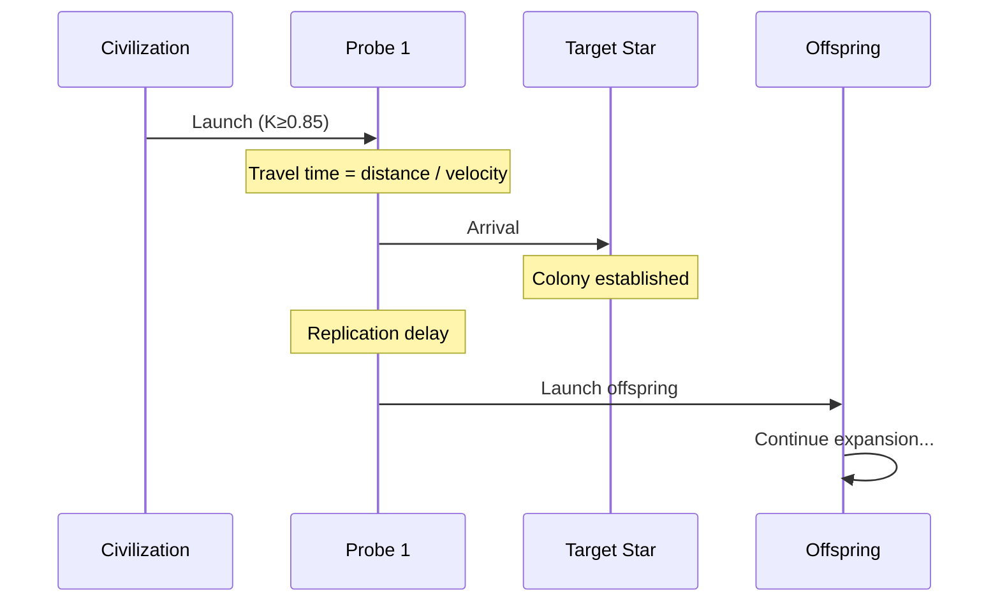

import { Aside, Tabs, TabItem } from '@astrojs/starlight/components';

# Probe Expansion Model

Great Silence models interstellar expansion through self-replicating probes (von Neumann probes).
This guide explains the expansion mechanics, probe parameters, and wavefront propagation.

## Overview

When a civilization reaches sufficient technological capability (K ≥ 0.85), it can launch 
self-replicating probes that:

1. **Travel** to nearby star systems at sub-light speeds
2. **Arrive** and establish a colony
3. **Replicate** using local resources
4. **Launch** offspring probes to further targets

This creates an exponentially expanding wavefront across the galaxy.

## Probe Parameters

Probe capabilities scale with Kardashev level at launch:

```python
from great_silence.civilization.probe_design import (
    probe_velocity_from_kardashev,
    per_hop_range_from_kardashev,
    offspring_count,
    replication_delay_years,
)

k_level = 0.85

velocity = probe_velocity_from_kardashev(k_level)     # 0.01c
hop_range = per_hop_range_from_kardashev(k_level)     # 5 pc
offspring = offspring_count(k_level)                   # 2 probes
delay = replication_delay_years(k_level)              # 80,000 years
```

### Scaling Functions

| K-Level | Velocity (c) | Range (pc) | Offspring | Replication (yr) |
|---------|--------------|------------|-----------|------------------|
| 0.85 | 0.01 | 5 | 2 | 80,000 |
| 0.90 | 0.02 | 10 | 2 | 60,000 |
| 1.00 | 0.03 | 15 | 3 | 50,000 |
| 1.50 | 0.10 | 40 | 5 | 25,000 |
| 2.00 | 0.30 | 80 | 7 | 12,000 |

<Aside type="note">
  Probe parameters are **locked** when expansion starts. A civilization that 
  advances from K=0.85 to K=1.5 still uses K=0.85 probe specs for all existing
  probes and their offspring.
</Aside>

## Expansion Flow



## Launch Mechanics

### Initial Launch

When expansion begins:

```python
def _launch_initial_probes(self, civ: CivilizationState):
    # Find targets within hop range
    targets = self._find_nearest_targets(
        civ.parent_star_idx,
        civ.locked_range_pc,
        civ.colonized_stars,
        civ.targeted_stars  # Already in-flight
    )
    
    for target_idx in targets[:civ.locked_offspring_count]:
        probe = ProbeState(
            probe_id=self._next_probe_id(),
            parent_probe_id=None,
            generation=0,
            launch_star_idx=civ.parent_star_idx,
            target_star_idx=target_idx,
            launch_time_myr=self.current_time_myr,
            arrival_time_myr=self._calculate_arrival_time(
                civ.parent_star_idx, target_idx, civ.locked_velocity_c
            ),
            velocity_c=civ.locked_velocity_c,
            per_hop_range_pc=civ.locked_range_pc,
            offspring_count=civ.locked_offspring_count,
            replication_delay_yr=civ.locked_replication_delay,
        )
        
        civ.targeted_stars.add(target_idx)
        self._register_probe(civ.civ_id, probe)
```

### Target Selection

Probes target the nearest uncolonized, untargeted stars:

```python
def _find_nearest_targets(
    self,
    source_idx: int,
    max_range_pc: float,
    colonized: Set[int],
    targeted: Set[int],
) -> List[int]:
    # Get all stars within range
    candidates = self.spatial_index.query_radius(
        self.galaxy.positions[source_idx],
        max_range_pc / 1000  # Convert pc to kpc
    )
    
    # Filter out colonized and targeted
    available = [
        idx for idx in candidates
        if idx not in colonized
        and idx not in targeted
        and idx in self.habitable_indices
    ]
    
    # Sort by distance
    distances = self._get_distances(source_idx, available)
    return [idx for _, idx in sorted(zip(distances, available))]
```

## Arrival and Colonization

When a probe arrives:

```python
def _handle_probe_arrival(self, probe_id: int):
    probe = self._probe_by_id[probe_id]
    civ = self._civ_by_id[probe.civ_id]
    
    # Mark star as colonized
    civ.colonized_stars.add(probe.target_star_idx)
    civ.targeted_stars.discard(probe.target_star_idx)
    
    # Schedule replication
    replication_time = (
        probe.arrival_time_myr + 
        probe.replication_delay_yr / 1e6
    )
    
    heapq.heappush(
        self.probe_events,
        (replication_time, "replication", probe_id)
    )
    
    probe.has_arrived = True
```

## Replication and Offspring

After the replication delay:

```python
def _handle_replication_complete(self, probe_id: int):
    probe = self._probe_by_id[probe_id]
    civ = self._civ_by_id[probe.civ_id]
    
    # Check limits
    if len(civ.active_probes) >= civ.max_active_probes:
        return
    if probe.generation >= self.config.civilization.max_probe_generation:
        return
    
    # Find new targets
    targets = self._find_nearest_targets(
        probe.target_star_idx,
        probe.per_hop_range_pc,
        civ.colonized_stars,
        civ.targeted_stars,
    )
    
    # Launch offspring
    for i, target_idx in enumerate(targets[:probe.offspring_count]):
        offspring = ProbeState(
            probe_id=self._next_probe_id(),
            parent_probe_id=probe_id,
            generation=probe.generation + 1,
            # ... inherit parameters
        )
        civ.targeted_stars.add(target_idx)
        self._register_probe(civ.civ_id, offspring)
```

## Expansion Limits

To prevent runaway growth, several limits apply:

| Limit | Default | Description |
|-------|---------|-------------|
| `max_colonies_per_civilization` | 1000 | Total colonies cap |
| `max_active_probes_per_civilization` | 500 | Concurrent in-flight probes |
| `max_probe_generation` | 20 | Replication depth (Hayflick limit) |

### Scaled Limits

When `use_scaled_probe_limits=True` (default), limits scale with galaxy size:

```python
# Effective limits
max_colonies = int(n_habitable_stars * max_colonies_fraction)  # 50%
max_probes = int(n_total_stars * max_active_probes_fraction)   # 5%
```

## Predictive Intercept

With stellar motion enabled, probes predict target star positions:

```python
def _calculate_intercept_position(
    self,
    launch_pos: np.ndarray,
    target_pos: np.ndarray,
    target_vel: np.ndarray,
    probe_velocity_c: float,
) -> Tuple[np.ndarray, float]:
    """Iteratively solve for intercept position."""
    
    intercept_pos = target_pos.copy()
    
    for _ in range(3):  # Usually converges in 2-3 iterations
        distance = np.linalg.norm(intercept_pos - launch_pos)
        travel_time = distance / (probe_velocity_c * C_PC_YR)
        intercept_pos = target_pos + target_vel * travel_time
    
    return intercept_pos, travel_time
```

<Aside type="tip">
  Enable with `config.simulation.probe_intercept_enabled = True`. 
  Probes will aim where the star will be, not where it is now.
</Aside>

## Wavefront Characteristics

### Expansion Speed

The expansion wavefront moves at approximately:

```
v_wavefront ≈ v_probe × (1 - t_replication / t_travel)
```

For typical parameters (v=0.01c, travel=500 ly, replication=80 kyr):
- Wave speed ≈ 0.005-0.008c
- Galaxy crossing time ≈ 10-20 Myr

### Colony Distribution

Colonies form a roughly spherical distribution centered on the origin:

```python
# Get colony positions
colony_positions = galaxy.positions[list(civ.colonized_stars)]

# Compute expansion radius
distances = np.linalg.norm(colony_positions - origin_pos, axis=1)
expansion_radius = np.max(distances)
```

## Visualization

The Three.js visualization shows:

- **Probe trails**: Lines from launch to current position
- **Colony markers**: Sprites at colonized stars
- **Wavefront**: The expanding sphere of influence

```python
from great_silence.visualization.threejs import export_html

export_html(
    sim,
    "expansion.html",
    animated=True,
    show_trajectories=True,  # Show probe trails
)
```

## Further Reading

- [Simulation Flow](/guides/simulation-flow/) — Complete simulation mechanics
- [Kardashev Scale](/concepts/kardashev-scale/) — How K-level affects probes
- [API: probe_design](/api/civilization-probe-design/) — Scaling function reference
