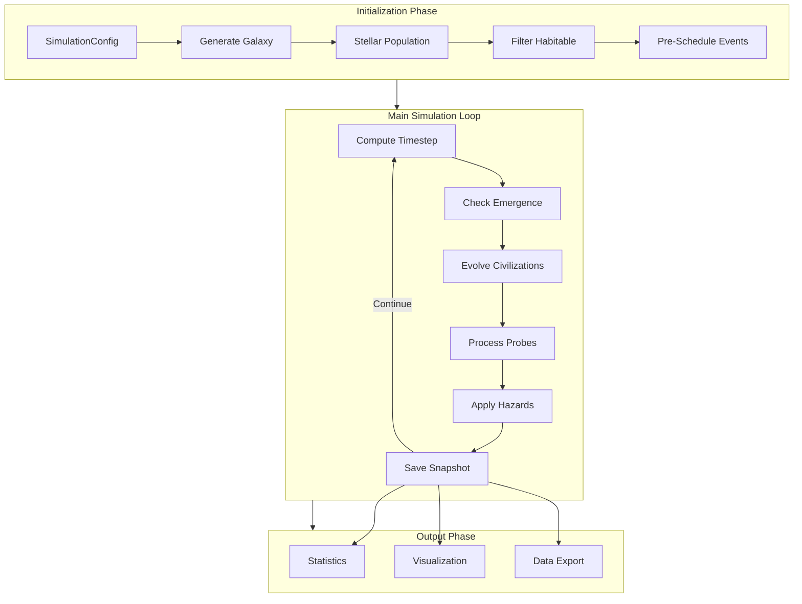
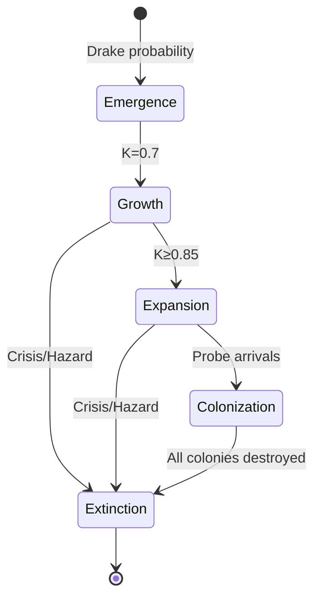

import { Aside } from '@astrojs/starlight/components';

# Simulation Flow

This guide explains the complete flow of a Great Silence simulation, from initialization
through the main loop to final analysis.

## High-Level Architecture



## Initialization Phase

### 1. Load Configuration

The simulation starts by loading a `SimulationConfig`:

```python
from great_silence import SimulationConfig, GalaxySimulation

config = SimulationConfig.with_preset("moderate")
config.galaxy.total_stars = 50_000
```

### 2. Generate Galaxy

The `GalaxyModel` creates the stellar population:

```python
# Inside GalaxySimulation.initialize()
self.galaxy = GalaxyModel(self.config.galaxy)
self.galaxy.generate_stellar_population(seed=self.seed)
```

This generates positions (3D coordinates using density profiles), ages (from star formation history with radial gradients), masses (sampled from initial mass function), metallicities (radial gradient from center outward), and velocities (optional gravitational equilibrium).

### 3. Filter Habitable Stars

Only certain stars can host civilizations:

```python
# Mass filter: 0.5-1.5 solar masses (F, G, K stars)
habitable_mask = (
    (self.galaxy.masses >= config.galaxy.habitable_mass_min_msun) &
    (self.galaxy.masses <= config.galaxy.habitable_mass_max_msun)
)
self.habitable_indices = np.where(habitable_mask)[0]
```

Typical result: ~20% of stars are habitable.

### 4. Pre-Schedule Events

For performance, events are pre-computed:

```python
# Pre-schedule disasters (supernovae, GRBs)
self.disaster_scheduler = UnifiedDisasterScheduler(
    galaxy=self.galaxy,
    config=self.config,
    seed=self.seed
)

# Pre-schedule civilization emergences
self._schedule_emergence_events()

# Pre-schedule star births (if enabled)
self._schedule_star_births()
```

## Main Simulation Loop

The core loop advances time in adaptive steps:

```python
while self.current_time_myr < self.end_time_myr:
    dt_myr = self._compute_next_timestep()
    self._step(dt_myr)
    self.current_time_myr += dt_myr
```

### Adaptive Timestep

The timestep adapts to simulation activity:

| Condition | Timestep |
|-----------|----------|
| No active civilizations | 10 Myr |
| Active civs, no pending events | 1 Myr |
| Probe events pending | 0.1 Myr |
| Disaster imminent | 0.01 Myr |

```python
def _compute_next_timestep(self) -> float:
    dt = self.config.simulation.max_timestep_myr
    
    # Check for pending events
    next_disaster = self.disaster_scheduler.peek_next_disaster_time()
    next_emergence = self._peek_next_emergence_time()
    next_probe_event = self._peek_next_probe_event_time()
    
    # Take minimum
    dt = min(dt, next_disaster - self.current_time_myr)
    dt = min(dt, next_emergence - self.current_time_myr)
    # ... etc
    
    return max(dt, self.config.simulation.min_timestep_myr)
```

### Single Step Operations

Each `_step(dt_myr)` performs:

```python
def _step(self, dt_myr: float):
    # 1. Evolve stellar positions (if enabled)
    if self.config.galaxy.enable_stellar_motion:
        self.galaxy.evolve_positions(dt_myr)
    
    # 2. Check for new civilizations
    self._check_civilization_emergence()
    
    # 3. Evolve existing civilizations
    self._evolve_civilizations(dt_myr)
    
    # 4. Process probe events (arrivals, replications)
    self._process_probe_events()
    
    # 5. Apply astrophysical hazards
    self._apply_hazards(dt_myr)
    
    # 6. Check for encounters and wars (if enabled)
    if self.config.civilization.encounters_enabled:
        self._scan_for_encounters()
        self._resolve_wars(dt_myr)
    
    # 7. Save snapshot (if interval reached)
    self._maybe_save_snapshot()
```

## Civilization Lifecycle



### Emergence

```python
def _check_civilization_emergence(self):
    # Get pre-scheduled emergences for this timestep
    emergences = self._get_emergences_in_window(
        self.current_time_myr,
        self.current_time_myr + dt_myr
    )
    
    for emergence in emergences:
        star_idx = emergence.star_idx
        
        # Skip if already colonized
        if star_idx in self.colonized_stars:
            continue
            
        # Skip if sterilized
        if self.recovery_queue.status[star_idx] != 0:
            continue
        
        # Create new civilization
        self._create_civilization(star_idx, emergence.time_myr)
```

### Growth

Each timestep, civilizations advance:

```python
def _advance_civilization_tech(self, civ: CivilizationState, dt_myr: float):
    # Advancement rate with randomness
    rate = self.config.civilization.kardashev_advancement_rate
    rate *= (1 + self.rng.normal(0, 0.1))  # Per-civ variation
    
    civ.kardashev_level += rate * dt_myr
    civ.kardashev_level = min(civ.kardashev_level, 3.0)
```

### Extinction Checks

```python
def _check_civilization_extinction(self, civ: CivilizationState, dt_myr: float):
    # 1. Self-destruction (Great Filter)
    if self.extinction_model.check_self_destruction(
        civ.kardashev_level, dt_myr, self.rng
    ):
        return "self_destruction"
    
    # 2. Age-based extinction
    age_myr = self.current_time_myr - civ.birth_time_myr
    if self.extinction_model.check_age_extinction(age_myr, dt_myr, self.rng):
        return "age_extinction"
    
    # 3. Check if all colonies destroyed
    if len(civ.colonized_stars) == 0:
        return "colonies_destroyed"
    
    return None  # Survived
```

## Event-Driven Architecture

Great Silence uses event queues for efficiency:

### Probe Event Queue

```python
# Min-heap ordered by time
self.probe_events = []  # [(time, event_type, probe_id), ...]

# O(log N) event retrieval
def _process_probe_events(self):
    while self.probe_events and self.probe_events[0][0] <= self.current_time_myr:
        time, event_type, probe_id = heapq.heappop(self.probe_events)
        
        if event_type == "arrival":
            self._handle_probe_arrival(probe_id)
        elif event_type == "replication":
            self._handle_replication_complete(probe_id)
```

### Disaster Event Queue

```python
# From UnifiedDisasterScheduler
disasters = self.disaster_scheduler.get_disasters_in_window(
    self.current_time_myr,
    self.current_time_myr + dt_myr
)

for disaster in disasters:
    self._apply_disaster_effects(disaster)
```

## Output Phase

### Statistics Collection

```python
stats = sim.get_statistics()

# Returns dict with:
# - total_civilizations
# - active_civilizations
# - peak_civilizations
# - total_colonized_systems
# - extinctions_by_hazard
# - extinctions_by_self_destruction
# - mean_civilization_lifetime
# - probe_statistics
# - disaster_counts
```

### Snapshots for Visualization

```python
# Each snapshot contains:
@dataclass
class SimulationSnapshot:
    time_myr: float
    stellar_positions: np.ndarray  # (N, 3)
    civilizations: List[CivilizationState]
    active_probes: List[ProbeSnapshot]
    recent_events: List[HazardEvent]
    statistics: Dict[str, Any]
```

<Aside type="tip">
  Snapshots use delta compression for stellar positions, storing only 
  initial positions and velocities. This reduces memory usage by ~95%
  for long simulations with stellar motion.
</Aside>

## Performance Characteristics

| Operation | Complexity | Notes |
|-----------|------------|-------|
| Initialization | O(N log N) | Star generation, spatial indexing |
| Emergence check | O(1) | Pre-scheduled events |
| Probe processing | O(K log K) | K = active probes |
| Hazard application | O(D × C) | D = disasters, C = civilizations |
| Snapshot save | O(N + P) | N = stars, P = probes |

For a typical 50,000 star simulation over 5 Gyr:
- **Initialization**: ~1-2 seconds
- **Main loop**: ~0.05-0.5 seconds (depends on activity)
- **Total runtime**: ~2-5 seconds

## Further Reading

- [Configuration Guide](/getting-started/configuration/) — Control all parameters
- [Probe Expansion](/guides/probe-expansion/) — Detailed expansion mechanics
- [API: GalaxySimulation](/api/simulation-engine/) — Full method reference
